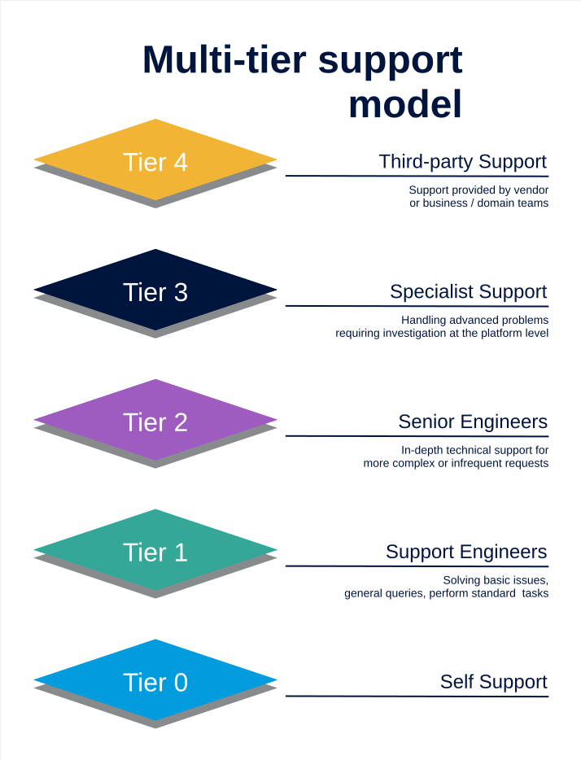

# Data Engineering Support Model
## Support, Triage and Resolution Framework

This document defines the operational support model for the Data Engineering team.  
It describes how issues are identified, triaged, resolved and escalated across the engineering team, managed services partners, specialist resources and third-party vendors.

The model follows a **five-tier support structure** designed to ensure:

- Clear ownership of operational response
- Efficient triage and escalation
- Separation between operational support and engineering design work
- Appropriate engagement with platform vendors and business stakeholders

### Inputs to the support process

The following systems are the pirmary input mechanisms for support:

- ServiceNow platform
- Automated alerts through the Data Engineering Inbox
- Emailed requests
- Automated alerts raised via code agents

The following channels should be avoided:

- Teams
- Phone

***Where requests / issues are raised via these channels they should be formalised through ServiceNow or the teams DevOps board.***

---

# Support Tier Model

The support structure escalates issues progressively from **self-service through operational support, engineering expertise, specialist intervention and finally external vendor or business engagement**.



```
Tier 0  →  Self Support
Tier 1  →  Support Engineers
Tier 2  →  Senior Engineers
Tier 3  →  Specialised Support
Tier 4  →  Third-party Support (Vendor / Business)
```

Issues should always be resolved at the **lowest effective tier** before escalation occurs.


---

# Tier Responsibilities


## Tier 0 — Self Support

Self-support is the first line of resolution and primarily serves business users, analysts and operational stakeholders.

Typical activities include:

- Reviewing documentation and platform runbooks  
- Checking data freshness or pipeline status dashboards  
- Validating report filters or parameters  
- Confirming expected datasets exist in the platform  
- Reviewing incident communications  

The objective at this stage is to resolve **simple visibility or usage issues without engineering intervention**.

Typical users:

- Business analysts  
- Data consumers  
- Product owners  

Escalation occurs when the issue is confirmed as:

- Data unavailable  
- Data incorrect  
- Pipeline failure  
- Platform performance degradation  


---

## Tier 1 — Support Engineers

Support Engineers provide the **first operational response to platform incidents**.

This tier is typically fulfilled by the **Data Engineering support team.** 

Responsibilities include:

- Incident logging and classification  
- Monitoring alert response  
- Pipeline or job restarts  
- Gateway or connectivity checks  
- Credential refresh or configuration validation  
- Basic platform health checks  
- Escalation coordination  

The objective at this stage is to **restore service quickly using Standard Operating Procedures (SOPs) and runbooks**.

Tier 1 should **not be expected to debug engineering logic or redesign pipelines**.


---

## Tier 2 — Senior Engineers

Senior Engineers provide **engineering-level investigation and remediation**.

This tier usually sits within the **Data Engineering team, but also includes other aligned engineers**.

Responsibilities include:

- Investigating pipeline failures  
- Debugging transformation logic  
- Resolving schema drift or ingestion failures  
- Investigating data quality issues  
- Pipeline performance tuning  
- Implementing operational fixes requiring code changes  
- Supporting managed services during escalations  

Tier 2 is responsible for **restoring service when engineering investigation is required**.


---

## Tier 3 — Specialised Support

Specialised Support is engaged when issues require **deep platform expertise or architectural intervention**.

Examples include:

- Platform architecture issues  
- Complex performance problems  
- Security model changes  
- Data model refactoring  
- Infrastructure configuration problems  
- Capacity or scaling issues  

This tier typically includes:

- Data platform architects  
- Senior platform engineers  
- Security specialists  
- Infrastructure specialists  

The objective is to **resolve structural issues and prevent recurrence**.


---

## Tier 4 — Third-Party Support

The final tier involves **external parties required to resolve issues outside the control of the engineering team**.

This may include vendor support for platforms like:

- Microsoft 
- Alteryx
- Workday
- Other vendors

It may also involve business escalation such as:

- Data ownership
- Source system defects  
- Data contract breaches  
- Data quality defects
- Business rule validation  

Tier 4 is engaged only when the issue requires **vendor intervention or business decision-making**.


---

# Support Escalation Journey

The typical support journey follows the progression below.

```
Business User / Monitoring Alert
        │
        ▼
Tier 1 – Support Engineers
        │
        ▼
Tier 2 – Senior Engineers
        │
        ▼
Tier 3 – Specialised Support
        │
        ▼
Tier 4 – Vendor / Business Engagement
```

Escalation should occur only when the current tier **cannot resolve the issue within its operational scope**.


---

# RACI Matrix

| Activity | Tier 0 Self Support | Tier 1 Support Engineers | Tier 2 Senior Engineers | Tier 3 Specialised Support | Tier 4 Vendor / Business |
|----------|--------------------|--------------------------|-------------------------|-----------------------------|--------------------------|
| Issue identification | R | A | I | I | I |
| Incident logging | I | R/A | I | I | I |
| Initial triage | I | R/A | C | I | I |
| Monitoring alert response | I | R/A | C | I | I |
| Pipeline restart / operational remediation | I | R | A | I | I |
| Platform health checks | I | R | A | C | I |
| Pipeline debugging | I | C | R/A | C | I |
| Data quality investigation | C | C | R/A | C | I |
| Schema or ingestion failure | I | C | R/A | C | I |
| Performance optimisation | I | I | R | A | C |
| Architectural remediation | I | I | C | R/A | C |
| Major platform outage | I | R | A | C | R |
| Root cause analysis | I | C | R | A | C |
| Post-incident review | I | C | R | A | I |
| Knowledge base updates | I | R | A | C | I |

Legend:

- **R** Responsible  
- **A** Accountable  
- **C** Consulted  
- **I** Informed  


---

# Operating Principles

## Operational work stops at Tier 1

Support Engineers focus on **operational stability**, not engineering investigation.


## Engineering teams should not become the service desk

Senior Engineers should engage only when:

- operational remediation fails  
- engineering investigation is required  
- code changes are necessary  


## Architectural work belongs at Tier 3

Platform architects and specialists should focus on:

- platform stability  
- scalability  
- preventative improvements  

They should not routinely resolve operational incidents.


## Vendor escalation should be controlled

Vendor support should only be engaged when:

- the platform itself is failing  
- infrastructure is degraded  
- external SaaS systems are the root cause  

## Business users own the definition of logic

The defined business owner should always be engaged when:

- a gap in a mapping or rule set exists
- a new value / category / label is required 
- data is being used in a new or changed context
- data quality issues exist.

---

# Outcome

This model ensures:

- Fast operational response  
- Clear escalation paths  
- Reduced dependency on SMEs for routine incidents  
- Appropriate engagement with vendors and business stakeholders  
- A sustainable support structure for the data platform